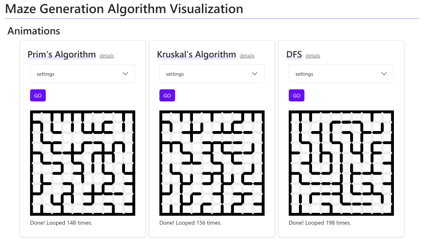

# Maze Generation with Spanning Tree

Maze generation animation with Prim's algorithm, Kruskal's algorithm and DFS.



## Description

A maze can be generated with spanning tree using graph nodes representing grid. [Maze Generation Algorithm - wikipedia](https://en.wikipedia.org/wiki/Maze_generation_algorithm)

Some algorithms to find minimum spanning tree include Prim's algorithm and Kruskal's algorithm. This program animates maze generation with the two. You can see the difference.

Additionally, it contains creating spanning tree maze with no loop random DFS.

## Installation

```bash
git clone https://github.com/halfminami/maze-generation-visualization.git
cd maze-generation-visualization
npm install
npm run dev
```

... will start Vite dev server.

## Uses

- React with Vite
- React Bootstrap

## Reference

- *(Japanese)* "Cによるアルゴリズムとデータ構造" (Algorithms and Data Structures with C) 茨木俊秀, ISBN 978-4-274-22391-4
